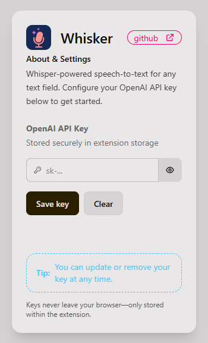

# Whisker — Whisper-Powered Text Input Companion

Bring hands-free input to any webpage. Whisker injects an elegant microphone control beside focused text fields and streams recordings straight to OpenAI Whisper for blazing-fast transcriptions.

## ✨ Highlights

- Instant mic button appears on every editable **field—inputs, textareas, and rich-text editors**
- Smooth recording UX with visual feedback, animated states, and resilient focus handling
- Whisper API integration with **zero back-end**: requests go directly from the page to OpenAI
- **Built-in onboarding**: missing API keys trigger an accessible, DaisyUI-themed modal with setup steps
- **Secure by design**: keys live in Chrome extension storage and never leak to page scripts

## Why Whisper

- Delivers consistently accurate transcripts across accents and noisy environments without extra tuning
- Handles longer dictation sessions thanks to streaming-friendly `webm` inputs and fast turnaround times
- Supports a wide range of languages and dialects out of the box
  `Afrikaans, Arabic, Armenian, Azerbaijani, Belarusian, Bosnian, Bulgarian, Catalan, Chinese, Croatian, Czech, Danish, Dutch, English, Estonian, Finnish, French, Galician, German, Greek, Hebrew, Hindi, Hungarian, Icelandic, Indonesian, Italian, Japanese, Kannada, Kazakh, Korean, Latvian, Lithuanian, Macedonian, Malay, Marathi, Maori, Nepali, Norwegian, Persian, Polish, Portuguese, Romanian, Russian, Serbian, Slovak, Slovenian, Spanish, Swahili, Swedish, Tagalog, Tamil, Thai, Turkish, Ukrainian, Urdu, Vietnamese, and Welsh.`
- Handles punctuation, capitalization, and common formatting automatically

## 🗂 Repository Tour

- `manifest.json` — Chrome extension manifest (Manifest V3) defining permissions, scripts, and popup entrypoint
- `content.js` — Core overlay logic: injects the mic button, records audio, and pipes it to Whisper
- `popup.html` — Extension popup UI for managing the OpenAI API key
- `popup.js` — Handles popup interactions, key persistence, and visibility toggling
- `popup.css` — Lightweight layout tweaks layered atop the generated Tailwind bundle
- `output.css` — Compiled Tailwind+DaisyUI stylesheet consumed by both the popup and modal
- `dev-test.html` — Local harness that mimics common fields for rapid iteration on the mic overlay
- `popup.*` assets — Shared UI imagery, including `logo.png`, for consistent branding

## 🚀 Quick Start

1. **Clone & open** the folder in your editor of choice.
2. **Load the extension** in a Chromium browser:
   - Visit `chrome://extensions`
   - Enable _Developer mode_
   - Click _Load unpacked_ and select the `Whisker` directory
3. **Authorize microphone access** when prompted the first time the content script requests it.
4. **Set your OpenAI API key** via the popup:
   - Click the Whisker icon in the browser toolbar
   - Paste your key in the _OpenAI API Key_ field and hit **Save key**
5. **Test anywhere**: focus any text field and tap the floating mic to dictate content.

## 🧩 How It Works

**Content overlay**

- Listens for `focusin` events and validates targets before displaying the mic control
- Positions the control with scroll/resize-aware geometry and animated state transitions
- Streams audio using the `MediaRecorder` API, batching chunks into a single `webm` blob
- Posts a multipart request to Whisper and inserts transcribed text at the cursor or caret location
- Handles edge cases such as denied permissions, concurrent recordings, and missing API keys

**Popup experience**

- Persists the key with `chrome.storage.sync` (falls back to `chrome.storage.local` when unavailable)
- Provides reveal/hide toggles, error states, and non-blocking status messages
- Keeps all copy on-device; no background scripts forward sensitive data

**Styling system**

- UI components lean on Tailwind CSS utilities and a custom DaisyUI theme compiled into `output.css`
- The same bundle is shared between the popup and the in-page key setup modal for a consistent feel

## 🛠 Development Workflow

- **Regenerate CSS**: Follow the steps [here](https://daisyui.com/docs/install/standalone/) to set up DaisyUI and TailwindCSS. the bundler files are excluded from the repo to reduce bloat.
- **Live mic testing**: open `dev-test.html` in a local web server and focus the provided fields to iterate quickly without leaving the browser
- **Extension debugging**: use Chrome’s _Extensions_ page to inspect the popup, and _DevTools > Sources_ to live-edit the content script
- **API sanity checks**: monitor network requests to `https://api.openai.com/v1/audio/transcriptions` to confirm payload shape and latency

## Roadmap

- Global hotkey support to toggle Whisker without relying on field focus
- Streaming transcription updates so dictated text appears while audio uploads
- Optional self-hosted Whisper endpoint configuration for on-prem or local inference
- Firefox-compatible build pipeline alongside the existing Chromium packaging

## 🔐 Security & Privacy Notes

- Whisper requests are sent directly from the content script; no proxy servers or third parties involved
- API keys remain inside Chrome-managed storage and are never exposed to the underlying page DOM
- Microphone streams are released as soon as recordings stop, ensuring the browser status light turns off immediately
- Error handling surfaces actionable feedback without leaking stack traces or sensitive details to end users

## 📸 Visuals

## 🤝 Contributing

- File issues describing expected vs. actual behavior and reproduction steps
- Fork, branch, and submit PRs with clear before/after context (screenshots or recordings encouraged)
- Include manual test notes for any feature touching the recording pipeline or storage layer
- Keep styles within the shared Tailwind design tokens so the overlay and popup remain consistent

## � License

- Distributed under the Whisker Source-Available License v1.0 (`LICENSE`)
- Commercial redistribution is allowed as long as recipients receive Whisker at no additional cost and attribution is preserved

## �📚 Useful References

- Chrome extension docs — [https://developer.chrome.com/docs/extensions](https://developer.chrome.com/docs/extensions)
- OpenAI Whisper transcription API — [https://platform.openai.com/docs/guides/speech-to-text](https://platform.openai.com/docs/guides/speech-to-text)
- Tailwind CSS — [https://tailwindcss.com](https://tailwindcss.com)
- DaisyUI component library — [https://daisyui.com](https://daisyui.com)
